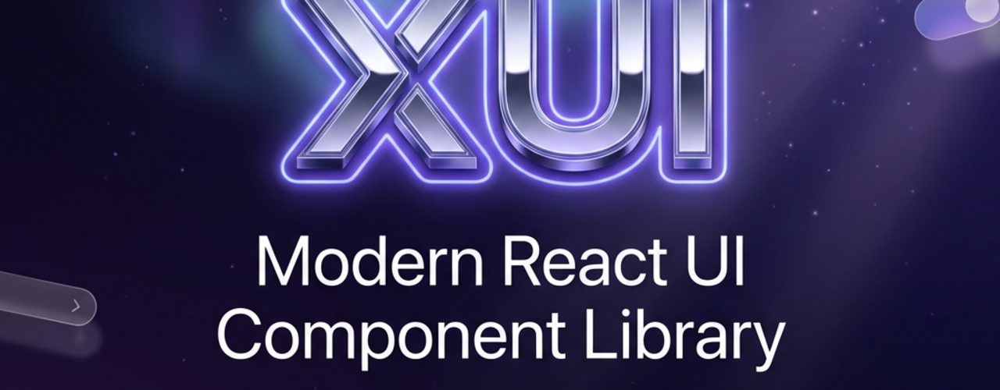

# X-UI

<p align="center">
  
</p>

<p align="center">
  Modern UI component library for <strong>React.js</strong>
</p>

<p align="center">
  
  
  
</p>

## ✨ Features

- 🎨 **Modern Design** - Glassmorphism, dark mode, micro-interactions
- 🌗 **Theme Support** - Built-in light/dark themes with customization
- ♿ **Accessible** - WCAG 2.1 AA compliant components
- 🔧 **TypeScript** - Full type safety and IntelliSense
- 🎯 **Tree-shakeable** - Import only what you need

## 📦 Packages

| Package | Description |
|---------|-------------|
| `@xdev-asia/x-ui-core` | Design tokens, hooks, and utilities |
| `@xdev-asia/x-ui-react` | React.js components |

## 🚀 Quick Start

### Installation

```bash
pnpm add @xdev-asia/x-ui-react
```

### Usage

```tsx
import { ThemeProvider, Button, Card, Input } from '@xdev-asia/x-ui-react';

function App() {
  return (
    <ThemeProvider>
      <Card variant="glass">
        <Input label="Email" placeholder="Enter your email" />
        <Button variant="solid" colorScheme="primary">
          Submit
        </Button>
      </Card>
    </ThemeProvider>
  );
}
```

## 🧩 Components

### Available Components

| Component | Description |
|-----------|-------------|
| ThemeProvider | Theme context provider |
| Button | Interactive button |
| Card | Content container |
| Avatar | User avatar |
| Badge | Status badge |
| Input | Text input |
| Spinner | Loading indicator |
| DataGrid | Advanced data table |
| TreeView | Hierarchical data |
| RichTextEditor | WYSIWYG editor |

See [implementation_plan.md](./implementation_plan.md) for the full roadmap.

## 🎨 Theming

```tsx
import { ThemeProvider } from '@xdev-asia/x-ui-react';

<ThemeProvider defaultTheme="dark">
  {/* Your app */}
</ThemeProvider>
```

### Using Theme Hook

```tsx
import { useXTheme } from '@xdev-asia/x-ui-react';

function MyComponent() {
  const { theme, mode, toggleMode } = useXTheme();
  
  return (
    <button onClick={toggleMode}>
      Current: {mode}
    </button>
  );
}
```

## 🛠 Development

```bash
# Install dependencies
pnpm install

# Build all packages
pnpm build

# Run development mode
pnpm dev

# Run tests
pnpm test
```

---

## 📐 Responsive Design

X-UI provides powerful responsive utilities.

### Responsive Values

```tsx
import { useResponsive, responsive } from '@xdev-asia/x-ui-react';

function MyComponent() {
  const padding = useResponsive({
    base: 4,
    sm: 4,
    md: 6,
    lg: 8,
    xl: 12,
  });

  return <Box p={padding}>Content</Box>;
}
```

### Breakpoints

| Name | Min Width |
|------|-----------|
| `sm` | 0px |
| `md` | 768px |
| `lg` | 1024px |
| `xl` | 1280px |
| `2xl` | 1536px |

---

## 🤖 MCP Server

X-UI includes an MCP (Model Context Protocol) server for AI-assisted component generation.

### Available Tools

| Tool | Description |
|------|-------------|
| `generate_component` | Generate new component code |
| `get_design_tokens` | Retrieve color, spacing, typography tokens |
| `list_components` | List all X-UI components |
| `get_component_usage` | Get usage examples for components |

---

## 📄 License

MIT
